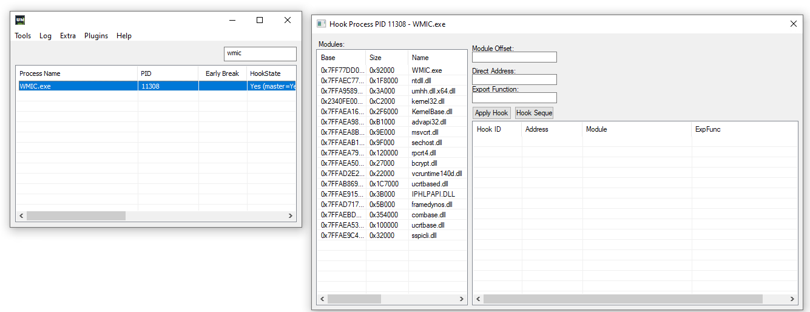

我给你一个大致的描述，然后你帮我整理出一份实现文档，后面我们按照该文档进行代码的实现

现在的情况是这样的，我需要给我们的程序添加一个功能，以使得我们可以hook当前还未加载的dll

一个实际的场景是这样的：

我想要调试wmic.exe进程中的一个dll中的代码，这个dll叫做fastprox.dll，但是他并不是在wmic.exe启动的时候就会加载，而是在wmic解析完用户传递给他的命令行参数以决定要做什么样的操作之后，才可能会被加载，但是这个时候我们已经没有机会hook了，因为之前的hook方案是下面这样的：

我们使用hook sequence按钮来使用一个hookseq文件指导我们如何进行hook，也就是上图右边的窗口，该窗口属于hookui.dll模块

但是由于此时fastprox.dll尚未加载，我们无法hook该dll中的代码

因此我们需要一种delay hook机制，使得我们可以hook尚未加载的dll的指定偏移处的代码

大致实现逻辑如下：

- 如果检测到目标dll尚未加载，则将该dll注册到待加载列表中
- hook当前ntdll的ldrloaddll函数，使得我们可以在该函数执行完成检测是否是目标dll加载完成
- 然后使用这个ntdll中的hook通知umcontroller.exe进程可以进行目标dll的hook了

另外一点需要说明的是，我的代码中之前已经实现了一部分相关的代码，但是之前的思路是错的，他是通过驱动来检测目标dll是否加载的，但是后续测试发现该方法是错误的，因此我需要你帮我删除相关代码