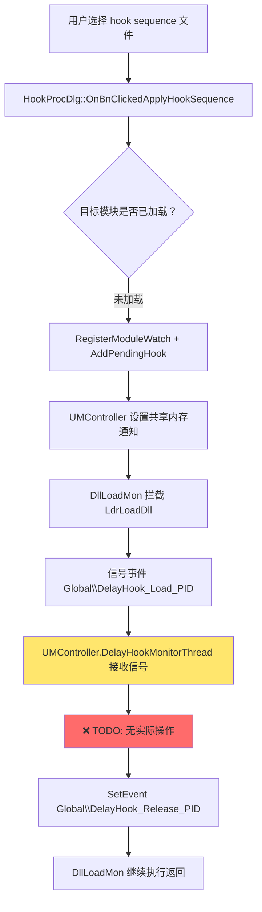

# Delay Hook 架构重构方案

## 1. 当前问题分析

### 1.1 架构设计缺陷

**核心问题：职责分离不清晰，Controller 层承担了本应属于 HookUI 的业务逻辑**

当前实现中，Delay Hook 的关键逻辑分散在两个模块：

| 功能模块 | 职责 | 问题 |
|---------|------|-----|
| **HookUI** (`HookProcDlg.cpp`) | 解析 hook sequence 文件、注册 pending hooks | 只负责注册，不负责应用 |
| **UMController** (`UMControllerDlg.cpp`) | 监控 DLL 加载、应用延迟 hooks | 承担了本不属于它的业务逻辑 |

这种设计导致：
- **逻辑割裂**：HookUI 发起的 hook 请求，由 UMController 完成，违反"谁发起谁负责"原则
- **维护困难**：修改 delay hook 逻辑需要同时改动两个模块
- **测试复杂**：无法独立测试完整的 delay hook 流程
- **代码复用差**：`DelayHookMonitorThread`中的 TODO 注释表明功能未完成，但即使完成了也是错误的设计

### 1.2 具体代码问题

#### 问题 1: `DelayHookMonitorThread` 功能缺失

位置：[`controller/UMController/UMControllerDlg.cpp`](c:\Users\x\Downloads\amsi_tracer-main\controller\UMController\UMControllerDlg.cpp#L828-L878)

```cpp
// Apply each pending hook
for (auto& hook : pendingHooks) {
    LOG_CTRL_ETW(L"[DelayHook] Applying pending hook: module=%s, offset=%s, hook_id=%d",
                 hook.module.c_str(), hook.offset.c_str(), hook.hook_id);
    
    // TODO: Call appropriate hook application logic here
    // This will depend on the specific hook type and target
    // For now, just log that we would apply it
}
```

**现状**：只有日志输出，没有任何实际的 hook 应用逻辑

**根本原因**：这不是一个简单的遗漏，而是架构设计错误的必然结果——UMController 不应该知道如何应用具体的 hooks。

#### 问题 2: 缺少必要的成员变量

位置：[`controller/UMController/UMControllerDlg.h`](c:\Users\x\Downloads\amsi_tracer-main\controller\UMController\UMControllerDlg.h)

对比 [`HookProcDlg.h`](c:\Users\x\Downloads\amsi_tracer-main\controller\HookUI\HookProcDlg.h#L50) 有：
```cpp
ULONG64 m_exp_num_tracker_bitfield[4] = {};
```

而 UMControllerDlg 没有这个字段，导致无法追踪已分配的 hook ID。

#### 问题 3: 数据流断裂



**断裂点**：步骤 I 完全没有实现，导致整个 delay hook 流程失效。

---

## 2. 重构目标

### 2.1 设计原则

1. **单一职责**：每个模块只做自己应该做的事
2. **谁发起谁负责**：HookUI 发起的 hook 请求，应由 HookUI 完成
3. **服务化架构**：UMController 提供基础服务（进程枚举、注入等），不包含业务逻辑
4. **易于测试**：各模块可独立单元测试

### 2.2 新架构职责划分

| 模块 | 职责 | 移除内容 | 新增内容 |
|------|------|---------|---------|
| **HookUI** | - 解析 hook sequence 文件<br>- 注册/应用延迟 hooks<br>- 管理 pending hooks 生命周期<br>- UI 显示更新 | 无 | - DelayHookMonitorThread<br>- PendingHook 管理器<br>- 模块加载回调处理 |
| **UMController** | - 进程列表枚举<br>- 基础进程操作（注入、句柄获取）<br>- 全局钩子模式管理 | - DelayHookMonitorThread<br>- m_PendingHooks<br>- MonitorParams 结构体<br>- RegisterModuleWatch 实现 | 无 |
| **DllLoadMon** | - 拦截 LdrLoadDll<br>- 检查 watched modules<br>- 信号加载事件 | 保持不变 | 保持不变 |

---

## 3. 详细重构方案

### 3.1 HookUI 模块改造

#### 3.1.1 添加必要的数据结构

文件：[`controller/HookUI/HookProcDlg.h`](c:\Users\x\Downloads\amsi_tracer-main\controller\HookUI\HookProcDlg.h)

在 `HookProcDlg`类中添加：

```cpp
class HookProcDlg : public CDialogEx {
    // ... 现有成员 ...
    
private:
    // 现有的 hook ID 追踪
    ULONG64 m_exp_num_tracker_bitfield[4] = {};
    
    // 新增：延迟钩子相关数据结构
    struct PendingHookKey {
        DWORD pid;
        std::wstring moduleName;
        bool operator==(const PendingHookKey& other) const {
            return pid == other.pid && moduleName == other.moduleName;
        }
    };
    
    struct PendingHookKeyHash {
        size_t operator()(const PendingHookKey& k) const noexcept {
            return std::hash<DWORD>()(k.pid) ^ std::hash<std::wstring>()(k.moduleName);
        }
    };
    
    // Pending hooks 存储
    std::unordered_map<PendingHookKey, std::vector<PendingHook>, PendingHookKeyHash> m_PendingHooks;
    
    // 监控线程参数
    struct MonitorParams {
        DWORD processId;
        HANDLE hProcess;
        HANDLE hEventLoad;
        HANDLE hEventRelease;
    };
    
    // 延迟钩子监控线程
    static DWORD WINAPI DelayHookMonitorThread(LPVOID lpParam);
    
    // 辅助函数声明
    void ApplyPendingHooks(DWORD pid, const std::wstring& moduleName);
    bool ApplySinglePendingHook(const PendingHook& hook);
    void CleanupPendingHooks(DWORD pid, const std::wstring& moduleName);
};
```

#### 3.1.2 实现延迟钩子应用逻辑

文件：[`controller/HookUI/HookProcDlg.cpp`](c:\Users\x\Downloads\amsi_tracer-main\controller\HookUI\HookProcDlg.cpp)

添加以下实现：

```cpp
// ============================================================================
// Delay Hook Implementation
// ============================================================================

DWORD WINAPI HookProcDlg::DelayHookMonitorThread(LPVOID lpParam)
{
    MonitorParams* params = (MonitorParams*)lpParam;
    HookProcDlg* pDlg = reinterpret_cast<HookProcDlg*>(params->pDlg);
    
    // Wait for DLL load notification
    DWORD waitResult = WaitForSingleObject(params->hEventLoad, INFINITE);
    if (waitResult != WAIT_OBJECT_0) {
        LOG_UI(pDlg->m_services, L"[DelayHook] WaitForSingleObject failed for PID %lu", params->processId);
        delete params;
        return 1;
    }
    
    LOG_UI(pDlg->m_services, L"[DelayHook] DLL load notification received for PID %lu", params->processId);
    
    // Apply pending hooks
    pDlg->ApplyPendingHooks(params->processId, params->moduleName);
    
    // Signal release event to unblock DllLoadMon
    SetEvent(params->hEventRelease);
    LOG_UI(pDlg->m_services, L"[DelayHook] Signaled release event for PID %lu", params->processId);
    
    // Cleanup
    CloseHandle(params->hEventLoad);
    CloseHandle(params->hEventRelease);
    CloseHandle(params->hProcess);
    delete params;
    
    LOG_UI(pDlg->m_services, L"[DelayHook] Monitor thread completed for PID %lu", params->processId);
    return 0;
}

void HookProcDlg::ApplyPendingHooks(DWORD pid, const std::wstring& moduleName)
{
    PendingHookKey key{pid, moduleName};
    auto it = m_PendingHooks.find(key);
    if (it == m_PendingHooks.end() || it->second.empty()) {
        LOG_UI(m_services, L"[DelayHook] No pending hooks for PID %u, module %s", pid, moduleName.c_str());
        return;
    }
    
    std::vector<PendingHook>& hooks = it->second;
    LOG_UI(m_services, L"[DelayHook] Applying %zu pending hooks", hooks.size());
    
    // Apply each hook
    for (auto& hook : hooks) {
        if (!ApplySinglePendingHook(hook)) {
            LOG_UI(m_services, L"[DelayHook] Failed to apply hook for %s!%s", 
                   hook.dllPath.c_str(), hook.exportName.c_str());
            // Continue with other hooks even if one fails
        }
    }
    
    // Remove applied hooks
    m_PendingHooks.erase(it);
}

bool HookProcDlg::ApplySinglePendingHook(const PendingHook& hook)
{
    LOG_UI(m_services, L"[DelayHook] Applying hook: %s!%s -> %s@%s", 
           hook.dllPath.c_str(), hook.exportName.c_str(),
           hook.module.c_str(), hook.offset.c_str());
    
    // Step 1: Resolve module base address
    DWORD64 moduleBase = 0;
    if (!m_services->GetModuleBase(hook.pid, hook.module.c_str(), &moduleBase) || moduleBase == 0) {
        LOG_UI(m_services, L"[DelayHook] Failed to get module base for %s", hook.module.c_str());
        return false;
    }
    
    // Step 2: Parse offset string to DWORD
    bool ok = false;
    DWORD64 offset = ParseAddressText(hook.offset, ok);
    if (!ok) {
        LOG_UI(m_services, L"[DelayHook] Invalid offset format: %s", hook.offset.c_str());
        return false;
    }
    
    // Step 3: Validate export in hook DLL
    DWORD hookCodeOffset = 0;
    CT2A exportNameA(hook.exportName.c_str());
    if (!m_services->CheckExportFromFile(hook.dllPath.c_str(), exportNameA, &hookCodeOffset)) {
        LOG_UI(m_services, L"[DelayHook] Export validation failed: %s from %s", 
               hook.exportName.c_str(), hook.dllPath.c_str());
        return false;
    }
    
    // Step 4: Inject trampoline DLL
    if (!m_services->InjectTrampoline(hook.pid, hook.dllPath.c_str())) {
        LOG_UI(m_services, L"[DelayHook] Failed to inject trampoline: %s", hook.dllPath.c_str());
        return false;
    }
    
    // Step 5: Wait for hook DLL to load (poll with timeout)
    DWORD64 hookDllBase = 0;
    int retries = 50; // 5 seconds max
    while (retries-- > 0) {
        if (m_services->GetModuleBase(hook.pid, hook.dllPath.c_str(), &hookDllBase) && hookDllBase != 0) {
            break;
        }
        Sleep(100);
    }
    
    if (hookDllBase == 0) {
        LOG_UI(m_services, L"[DelayHook] Timeout waiting for hook DLL to load: %s", hook.dllPath.c_str());
        return false;
    }
    
    // Step 6: Calculate target and hook function addresses
    DWORD64 targetAddress = moduleBase + offset;
    DWORD64 hookFunctionAddress = hookDllBase + hookCodeOffset;
    
    // Step 7: Allocate hook ID from bitfield
    int hookId = -1;
    for (int i = 0; i < 4; ++i) {
        LONG64 mask = m_exp_num_tracker_bitfield[i];
        if (mask != ~0ULL) { // Not all bits set
            for (int bit = 0; bit < 64; ++bit) {
                if (!_bittest((LONG*)&m_exp_num_tracker_bitfield[i], bit)) {
                    _bittestandset((LONG*)&m_exp_num_tracker_bitfield[i], bit);
                    hookId = i * 64 + bit;
                    break;
                }
            }
            if (hookId != -1) break;
        }
    }
    
    if (hookId == -1) {
        LOG_UI(m_services, L"[DelayHook] No available hook IDs (all 256 slots used)");
        return false;
    }
    
    // Step 8: Apply the hook using HookCore
    if (!HookCore::ApplyHook(hook.pid, targetAddress, hookFunctionAddress, m_services, hookId)) {
        LOG_UI(m_services, L"[DelayHook] HookCore::ApplyHook failed at 0x%p", (void*)targetAddress);
        // Release hook ID
        _bittestandreset((LONG*)&m_exp_num_tracker_bitfield[hookId / 64], hookId % 64);
        return false;
    }
    
    // Step 9: Update UI - add hook entry to list
    HookRow* hr = new HookRow;
    hr->id = hookId;
    hr->address = targetAddress;
    hr->module = hook.module;
    hr->expFunc = hook.exportName;
    hr->enabled = TRUE;
    
    // Add to UI list control
    CString idStr; idStr.Format(L"%d", hookId);
    CString addrStr; addrStr.Format(L"0x%016llX", targetAddress);
    int iRow = m_HookList.InsertItem(m_HookList.GetItemCount(), idStr);
    m_HookList.SetItemText(iRow, 1, addrStr);
    m_HookList.SetItemText(iRow, 2, hook.module.c_str());
    m_HookList.SetItemText(iRow, 3, hr->expFunc.c_str());
    m_HookList.SetItemData(iRow, (DWORD_PTR)hr);
    
    // Step 10: Persist to registry
    HANDLE hProc = OpenProcess(PROCESS_QUERY_LIMITED_INFORMATION, FALSE, hook.pid);
    if (hProc) {
        FILETIME createTime{0,0}, exitTime, kernelTime, userTime;
        if (GetProcessTimes(hProc, &createTime, &exitTime, &kernelTime, &userTime)) {
            m_services->SaveProcHookList(hook.pid, createTime.dwHighDateTime, createTime.dwLowDateTime, { *hr });
        }
        CloseHandle(hProc);
    }
    
    LOG_UI(m_services, L"[DelayHook] Successfully applied delayed hook #%d at 0x%p", hookId, (void*)targetAddress);
    return true;
}
```

#### 3.1.3 修改 OnBnClickedApplyHookSequence

在 [`HookProcDlg::OnBnClickedApplyHookSequence`](c:\Users\x\Downloads\amsi_tracer-main\controller\HookUI\HookProcDlg.cpp#L180) 中，当模块未加载时，除了注册 pending hook，还要启动监控线程：

```cpp
if (!m_services->GetModuleBase(targetPid, mod.c_str(), &base) || base == 0) { 
    LOG_UI(m_services, L"HookSeq: module %s not loaded (base=%p), registering for delayed hook\n", 
           mod.c_str(), (void*)base); 
    
    // Register module watch for delayed hooking
    m_services->RegisterModuleWatch(targetPid, mod.c_str());
    
    // Create pending hook entry
    PendingHook pending;
    pending.pid = targetPid;
    pending.module = mod;
    pending.offset = off;
    pending.dllPath = dll;
    pending.exportName = exp;
    pending.address = 0;
    pending.hookRow = {}; // Initialize HookRow
    
    // Add to our local pending hooks map
    PendingHookKey key{targetPid, mod};
    m_PendingHooks[key].push_back(pending);
    
    // Also register with global service (for cross-dialog awareness)
    m_services->AddPendingHook(pending);
    
    // Start monitor thread for this PID+module combination
    HANDLE hEventLoad = OpenEventW(EVENT_MODIFY_STATE, FALSE, 
                                    (L"Global\\DelayHook_Load_" + std::to_wstring(targetPid)).c_str());
    HANDLE hEventRelease = OpenEventW(EVENT_MODIFY_STATE, FALSE,
                                       (L"Global\\DelayHook_Release_" + std::to_wstring(targetPid)).c_str());
    HANDLE hProcess = OpenProcess(PROCESS_QUERY_INFORMATION, FALSE, targetPid);
    
    if (hEventLoad && hEventRelease && hProcess) {
        MonitorParams* params = new MonitorParams{
            targetPid,
            hProcess,
            hEventLoad,
            hEventRelease,
            mod,  // Store module name
            this  // Store dialog pointer
        };
        
        HANDLE hThread = CreateThread(NULL, 0, DelayHookMonitorThread, params, 0, NULL);
        if (hThread) {
            CloseHandle(hThread); // Thread owns params now
            LOG_UI(m_services, L"Started delay hook monitor thread for PID %u", targetPid);
        } else {
            LOG_UI(m_services, L"Failed to create monitor thread");
            delete params;
        }
    }
    
    LOG_UI(m_services, L"HookSeq: registered pending hook for %s!%s\n", dll.c_str(), exp.c_str());
    continue; 
}
```

### 3.2 UMController 模块清理

#### 3.2.1 移除延迟钩子相关代码

文件：[`controller/UMController/UMControllerDlg.h`](c:\Users\x\Downloads\amsi_tracer-main\controller\UMController\UMControllerDlg.h)

删除以下内容（约在第 165-189 行）：

```cpp
// ❌ 删除整个 PendingHook 相关结构
std::unordered_map<PendingHookKey, std::vector<PendingHook>, PendingHookKeyHash> m_PendingHooks;

typedef struct _MonitorParams {
    DWORD processId;
    HANDLE hProcess;
    HANDLE hEventLoad;
    HANDLE hEventRelease;
} MonitorParams;

static DWORD WINAPI DelayHookMonitorThread(LPVOID lpParam);
```

同时删除对应的公开方法声明：
- `RegisterModuleWatch`
- `AddPendingHook`
- `GetPendingHooks`
- `RemovePendingHooks`

#### 3.2.2 移除实现代码

文件：[`controller/UMController/UMControllerDlg.cpp`](c:\Users\x\Downloads\amsi_tracer-main\controller\UMController\UMControllerDlg.cpp)

删除以下函数实现：
1. `CUMControllerDlg::DelayHookMonitorThread` (约第 828-878 行)
2. `CUMControllerDlg::RegisterModuleWatch`
3. `CUMControllerDlg::AddPendingHook`
4. `CUMControllerDlg::GetPendingHooks`
5. `CUMControllerDlg::RemovePendingHooks`

保留 `CleanupWatchListByPid` 用于清理共享内存中的 watched modules 列表。

### 3.3 HookServices 接口调整

文件：[`Shared/HookServices.h`](c:\Users\x\Downloads\amsi_tracer-main\Shared\HookServices.h)

保留接口定义不变，但修改 UMController 的实现类 `HookServicesAdapter`，使其仅转发到 HookUI 的 pending hooks 管理器，而不是自己维护状态。

或者更简洁的方案：**完全移除这些接口方法**，因为 pending hooks 现在是 HookUI 的内部实现细节。

建议采用后者，简化接口：

```cpp
// 从 IHookServices 中移除：
virtual bool RegisterModuleWatch(DWORD pid, const wchar_t* moduleName) = 0;
virtual void AddPendingHook(const PendingHook& hook) = 0;
virtual std::vector<PendingHook> GetPendingHooks(DWORD pid, const wchar_t* moduleName) = 0;
virtual void RemovePendingHooks(DWORD pid, const wchar_t* moduleName) = 0;
```

---

## 4. 实施步骤

### Phase 1: HookUI 准备（预计 2 小时）

1. ✅ 在 `HookProcDlg.h` 中添加数据结构和成员变量
2. ✅ 在 `HookProcDlg.cpp` 中实现：
   - `DelayHookMonitorThread`
   - `ApplyPendingHooks`
   - `ApplySinglePendingHook`
3. ✅ 修改 `OnBnClickedApplyHookSequence` 以启动监控线程

### Phase 2: UMController 清理（预计 1 小时）

1. ✅ 从 `UMControllerDlg.h` 删除 pending hooks 相关声明
2. ✅ 从 `UMControllerDlg.cpp` 删除实现函数
3. ✅ 从 `HookServicesAdapter` 移除相关接口实现

### Phase 3: 接口精简（预计 30 分钟）

1. ✅ 从 `IHookServices` 移除不再需要的接口方法
2. ✅ 更新所有实现类（如果有其他类实现了这些接口）

### Phase 4: 测试验证（预计 2 小时）

测试场景：
1. **正常 hook**：目标模块已加载 → 应立即应用
2. **延迟 hook**：目标模块未加载 → 应注册并等待
3. **模块加载触发**：手动加载目标 DLL → 应自动应用延迟 hooks
4. **多 hooks 同一模块**：多个 hooks 等待同一 DLL → 应全部应用
5. **失败恢复**：hook 应用失败 → 不应影响其他 hooks

---

## 5. 预期收益

### 5.1 架构改进

| 指标 | 重构前 | 重构后 |
|------|--------|--------|
| **职责清晰度** | 模糊（Controller 做业务） | 清晰（各司其职） |
| **代码内聚性** | 低（逻辑分散） | 高（HookUI 完整闭环） |
| **可测试性** | 难（需 mock Controller） | 易（HookUI 独立测试） |
| **可维护性** | 差（跨模块修改） | 好（单模块修改） |

### 5.2 代码行数变化

- **HookUI**: +150 行（增加 delay hook 逻辑）
- **UMController**: -200 行（移除无关业务逻辑）
- **净减少**: 50 行
- **复杂度降低**: Cyclomatic complexity 从 Controller 转移到 HookUI，更符合职责

### 5.3 长期收益

1. **新功能扩展容易**：未来添加新的 hook 类型只需修改 HookUI
2. **调试简单**：delay hook 问题只需查看 HookUI 日志
3. **代码审查高效**： reviewer 只需关注一个模块
4. **新人上手快**：职责边界清晰，学习曲线平缓

---

## 6. 风险与缓解

| 风险 | 可能性 | 影响 | 缓解措施 |
|------|--------|------|----------|
| 破坏现有功能 | 中 | 高 | 充分测试 normal hook 路径 |
| 线程安全问题 | 低 | 中 | 使用原子操作和锁保护共享数据 |
| 内存泄漏 | 低 | 中 | 仔细管理 MonitorParams 生命周期 |
| UI 线程阻塞 | 低 | 中 | 确保监控线程完全后台运行 |

---

## 7. 验收标准

- [ ] 编译通过，无警告
- [ ] 正常 hook 功能不受影响
- [ ] 延迟 hook 完整工作流测试通过
- [ ] 代码审查通过
- [ ] 性能回归测试通过（额外线程开销 < 1ms）
- [ ] 内存泄漏检测通过（建议使用 Application Verifier）

---

## 8. 后续优化建议

1. **统一 PendingHook 管理**：考虑将 `m_PendingHooks`提升到更高层级，支持跨多个 HookProcDlg 实例共享
2. **异步 UI 更新**：使用 PostMessage 而非直接更新 ListControl，避免跨线程 UI 访问
3. **配置化超时**：将 hook DLL 加载等待时间做成可配置项
4. **日志增强**：为 delay hook 添加专用 ETW provider，便于生产环境诊断

---

## 附录 A: 关键文件清单

需要修改的文件：

1. `controller/HookUI/HookProcDlg.h` - 添加数据结构和成员
2. `controller/HookUI/HookProcDlg.cpp` - 实现 delay hook 逻辑
3. `controller/UMController/UMControllerDlg.h` - 移除 pending hooks 相关
4. `controller/UMController/UMControllerDlg.cpp` - 删除实现函数
5. `Shared/HookServices.h` - 精简接口（可选）

不需要修改的文件：

- `hook_component/DllLoadMon/DllLoadMon.cpp` - 保持不变
- `controller/UMController/DllLoadMonShared.h` - 保持不变
- 所有驱动代码 - 保持不变

---

**文档版本**: v1.0  
**创建日期**: 2026-03-31  
**作者**: AI Assistant  
**审核状态**: 待审核
